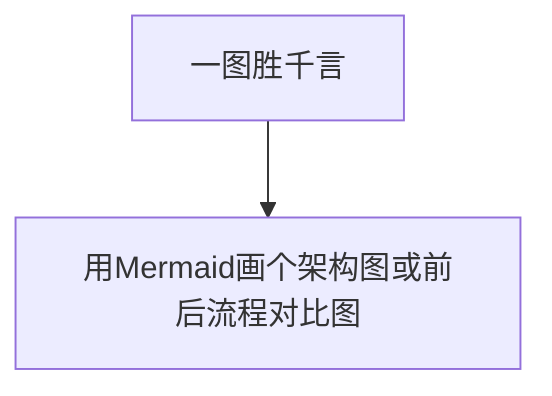

# [想一个吸引眼球但不要太UC震惊部的标题，比如："终于有人把XXX讲明白了" 或 "带你扒一扒XXX的源码"]

> *Image prompt: [如果是生成的，这里简述 prompt，英文]*

[开篇闲聊：直接切入痛点。比如最近在写什么代码遇到了什么坑，或者业界最近有什么痛楚，然后自然引出今天要聊的这个项目/论文。绝对不要写"近年来"、"随着科技的发展"这种废话或者空话。]

## 这是个啥玩意？ / 核心要解决什么问题？
[用大白话通俗解释这个项目的核心概念。如果是论文，一句话说明它提出了什么颠覆性理论；如果是代码，说明它解决了你的什么开发痛楚。]

## 硬核拆解 / 原理探秘
[如果是一篇学术论文：它是怎么做到的？网络架构长啥样？如果是GitHub仓库：它的牛逼之处在哪？挑一两个核心代码逻辑、架构设计或者特性，聊聊为什么作者要这么设计。带点个人视角的点评，比如"这种设计确实挺巧妙的..." 或者 "这个思路让人眼前一亮"。]

## 效果到底咋样？
[如果是论文：直接列最亮眼的数据，告诉大家它凭什么发顶会。如果是代码：聊聊性能、真实业务使用体验或者社区反响。不要机械地罗列指标数据，要带主观情绪，比如："这个响应速度真的是肉眼可见的快..."]

## 碎碎念 / 写在最后
[不要用"总之"、"综上所述"。用真人的口吻总结一句即可，比如："整体看下来，这个项目还是很值得一试的，特别是对于经常和XXX打交道的同学。" 给个行动号召："大家如果刚好有这方面的需求，可以去原仓库扒下来跑跑看" 或者附上开源链接。]
